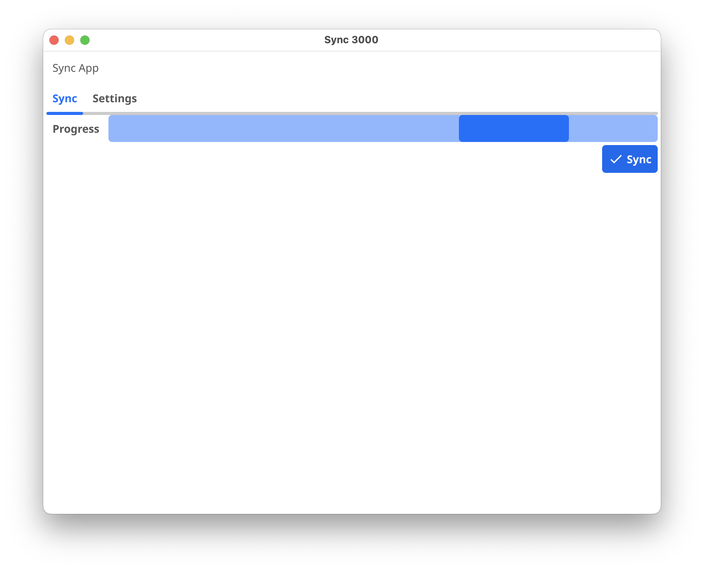

# Sync 3000



Sync 3000 is a free and open-source application designed for synchronizing data with Amazon S3 storage. This application provides a simple and user-friendly interface for configuring S3 settings and managing synchronization tasks.

## Features

- **S3 Settings Form**: Easily configure your Amazon S3 settings, including bucket name, region, access key ID, secret access key, endpoint, and local path.
- **Save Settings**: Save your configured S3 settings for future use by clicking the "Save" button in the Settings tab.
- **Synchronization**: Initiate data synchronization by clicking the "Sync" button, which performs synchronization using the specified S3 settings and local path.
- **System Tray Integration**: Run the application in the system tray to access key functionalities like showing the application window and triggering synchronization.

## Prerequisites

- Go (Golang) environment
- Fyne library (v2)

## Installation

1. Clone the repository:
```bash
git clone https://github.com/Inxo/s3-sync.git
cd repository
```

2. Install dependencies:
```bash
go get fyne.io/fyne/v2
go get github.com/joho/godotenv
go get inxo.ru/sync/sync
```

3. Build and run the application:
```bash
go run main.go
```

## Usage

- Fill in the required S3 settings in the "Settings" tab.
- Click the "Save" button to save your settings for future use.
- Switch to the "Sync" tab.
- Click the "Sync" button to initiate data synchronization.

## .env Example

```dotenv
LOCAL_PATH=/Users/inxo/Pictures/teasers
BUCKET_NAME=test-bucket
AWS_ACCESS_KEY_ID=key_id
AWS_SECRET_ACCESS_KEY=access_key
AWS_ENDPOINT=https://tw-001.s3.synologyc2.net
AWS_REGION=tw-001
SYNC_IGNORE_DOTS=true
```
## Free Object storage

- [Synology C2](https://c2.synology.com/en-uk/pricing/object-storage) - 15 Gb
- [Cloudflare R2](https://developers.cloudflare.com/r2/pricing/) - 10 Gb
- [Backblaze B2](https://www.backblaze.com/cloud-storage/pricing) - 10 Gb

## License

This project is licensed under the MIT License.

## Acknowledgments

- Fyne - UI toolkit and app API for Go.